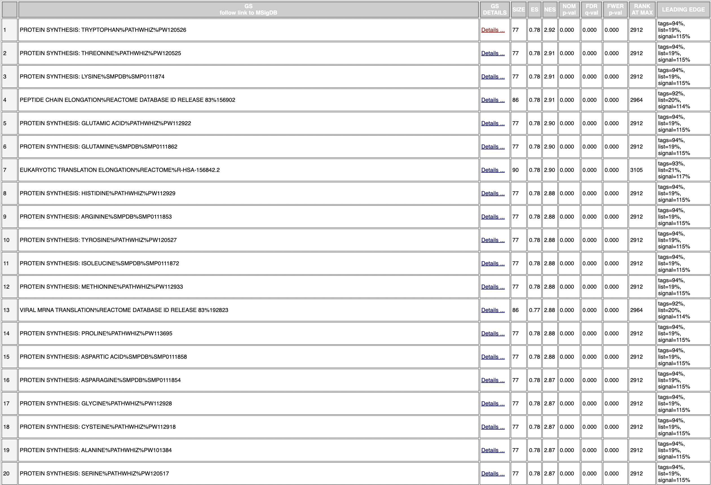
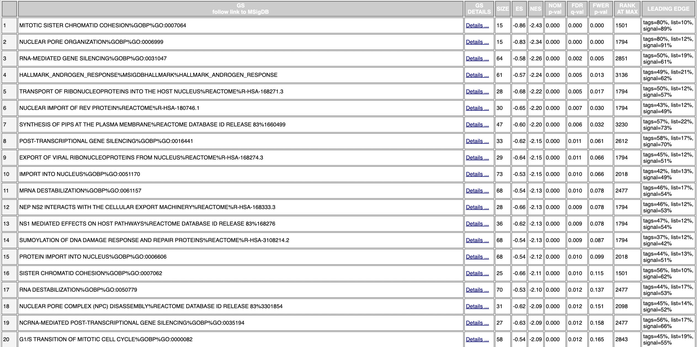
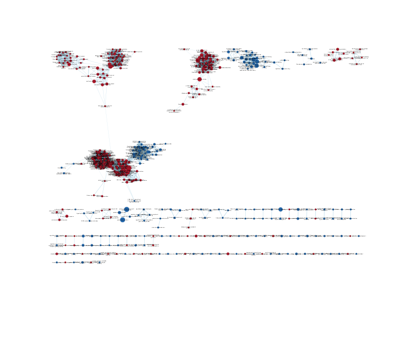
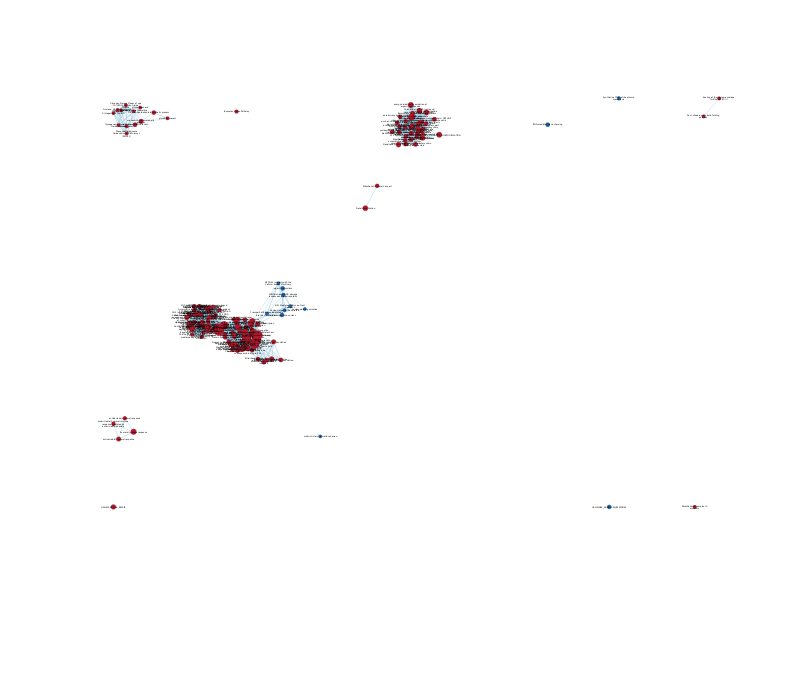
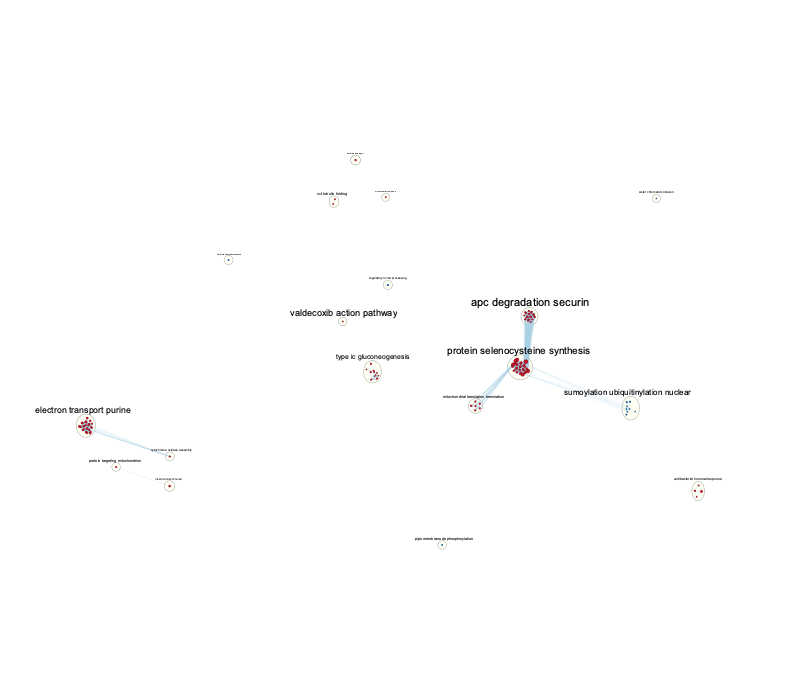
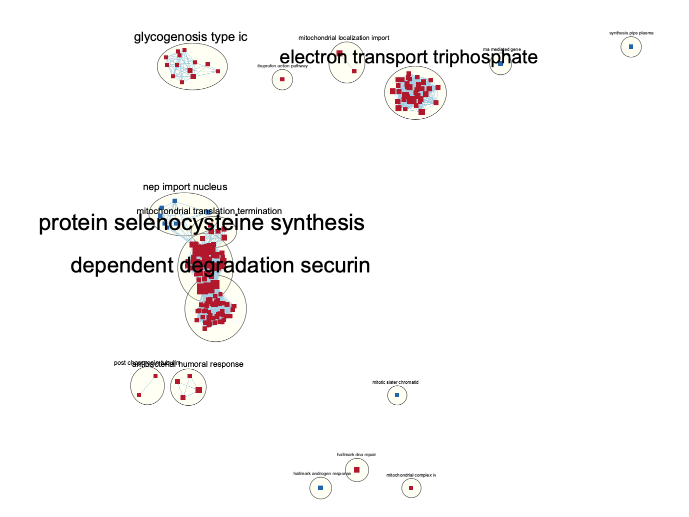

```{r, message = FALSE, warning = FALSE, include = FALSE}
if (!requireNamespace("BiocManager", quietly = TRUE)) {
  install.packages("BiocManager")
}
if (!requireNamespace("knitr", quietly = TRUE)) {
  install.packages("knitr")
}
if (!requireNamespace("RCurl", quietly = TRUE)) {
  install.packages("RCurl")
}
```

## Introduction

Ankylosing spondylitis (AS), is an inflammatory disease that can cause some of 
the bones in the spine, called vertebrae, to fuse. This fusing makes the spine 
less flexible and can result in a hunched posture. Some researches suggest that 
immune responses mediated by interleukin 17 (IL-17) play a pivotal role in the disease
The dataset I selected is "Differentially Expressed Genes in Males and Females 
with Ankylosing Spondylitis (AS): Discrete Effectors in IL-17-producing Cells of 
Patients with AS." (GSE221786). The control is the healthy human male and female 
samples, and the test conditions are the patients with Ankylosing Spondylitis. 
The goal of the experiment is to compare differential effectors of IL-17 pathway 
between male and female patients with ankylosing spondylitis (AS).

### Dataset Download and Cleaning
In Assignment 1, the dataset was processed and cleaned for low counts, normalized 
using TMM (Trimmed Mean of M-Values) and mapped to HUGO identifiers. Duplicate 
HUGO ids were averaged and genes with empty/unavailable HUGO ids were removed. 
The initial downloaded GEO dataset covers 25228 genes, however the final 
processed dataset, contained 15005 unique genes.
```{r a1, message=FALSE,warning=FALSE}
# data_processing.R is a script that implements the workflow performed in Assignment 1
source("data_processing.R")
kable(normalized_counts[1:5,1:5], format = "html")
```
### Preliminary Differential Expression Analysis
Next, in Assignment 2, the cleaned dataset was used to rank the 
gene set based on significant differential expression by using FDR correction,
based on the edgeR package, and 5172 genes passed the correction. The threshould 
over-representation analysis was conducted. I used Quasi-likelihood models to fit 
my data and used QLFTest to test for differential expression. There are 
7381 genes pass the p-value = 0.05, and 5735 genes that pass the FDR correction.
```{r a2, results='hide', message=FALSE, warning=FALSE}
source("gene_ranking.R")
```   

## Non-thresholded Geneset Enrichment Analysis

In A2, we extracted only the genes with a high enough p-value to perform a thresholded analysis. In this workflow we will use the full ranked geneset instead. The above script ranks the genes by log-fold change and produces the `ranked_genes` table, which we will write into a `ranked_genes.rnk` file for GSEA.

```{r rnk}
# Extract gene list and score by -log(qvalue) * sign(FC)
gene_table <- ranked_genes[["table"]]
gene_names <- rownames(gene_table)
q_value <- gene_table$FDR
signFC <- sign(gene_table$logFC)
rank <- -log(q_value) * signFC
rownames(gene_table) <- NULL
rnk_table <- cbind(gene_names, rank)
colnames(rnk_table) <- c("gene_names", "rank")
write.table(rnk_table, "ranked_genes.rnk", row.names=FALSE, sep='\t',quote=FALSE)
```

### Download Bader lab genesets
```{r download_pathways, message=FALSE, results='hide'}
gmt_url = "http://download.baderlab.org/EM_Genesets/current_release/Human/symbol/"
# list all the files on the server
filenames = RCurl::getURL(gmt_url)
tc = textConnection(filenames)
contents = readLines(tc)
close(tc)
# get the gmt that has all the pathways and does not include terms inferred from
# electronic annotations(IEA) start with gmt file that has pathways only
rx = gregexpr("(?<=<a href=\")(.*.GOBP_AllPathways_no_GO_iea.*.)(.gmt)(?=\">)", contents, 
    perl = TRUE)
gmt_file = unlist(regmatches(contents, rx))
dest_gmt_file <- file.path(gmt_file)
download.file(paste(gmt_url, gmt_file, sep = ""), destfile = dest_gmt_file)
```
### GSEA Interpretation
__1. What method did you use? What genesets did you use? Make sure to specify versions and cite your methods.__

The rankings.rnk and Bader geneset collection are used to perform a non-thresholded 
pathway analysisusing GSEA version 4.3.2. I used `ranked_genes.rnk` as my ranked gene list and [Human_GOBP_AllPathways_no_GO_iea_April_02_2023_symbol.gmt](http://download.baderlab.org/EM_Genesets/April_02_2023/Human/symbol/Human_GOBP_AllPathways_no_GO_iea_April_02_2023_symbol.gmt) (from http://download.baderlab.org/EM_Genesets/, April 2023 release) as my gene sets database as inputs for a pre-ranked GSEA. Default geneset size of 15-500 with 1000 permutations was used. Gene symbols are set to "No_Collapse." 

__2. Summarize your enrichment results.__

Below are screenshots of the top 20 hits of each phenotype:


\n


Comparing these results to my A2 results, we see that cell structure, migration, chemotaxis, and chemokine response are common across the most upregulated genesets. This represents a striking similarity to the g:Profiler thresholded ORA results. However, direct comparison is difficult, as the scope of each geneset here is largely different from those referenced by g:Profiler -- the genesets I used for GSEA are much more specific and smaller scope than the g:Profiler ones.

## Visualize Gene set Enrichment Analysis in Cytoscape

__1. Create an enrichment map - how many nodes and how many edges in the resulting map? What thresholds were used to create this map? Make sure to record all thresholds. Include a screenshot of your network prior to manual layout.__

The GSEA output was use with the EnrichmentMap App in Cytoscape Version: 3.9.1. The Q-value used was 0.1 and then default Edge Cutoff was used (0.375). As seen below, the resulting network was quite large, so we must filter our view to relevant clusters. This network has too many nodes and edges to meaningfully navigate, so I decreased the node cut-off to 0.01.





__2. Annotate your network - what parameters did you use to annotate the network. If you are using the default parameters make sure to list them as well.__

The AutoAnnotate Cytoscape App was used to annotate the above EnrichmentMap, the default selection of MCL CLuster algorithm was used, and the "Layout network to prevent cluster overlap" was selected for network readability. 36 annotations were produced.

__3. Make a publication ready figure - include this figure with proper legends in your notebook.__




__4. Collapse your network to a theme network. What are the major themes present in this analysis? Do they fit with the model? Are there any novel pathways or themes?__

The major themes in the network are protein selenocysteine synthesis, dependent
degradation securin, electron transport triphosphate, and glycogenosis type ic.



## References

* Robinson MD, McCarthy DJ, Smyth GK (2010). “edgeR: a Bioconductor package for differential expression analysis of digital gene expression data.” Bioinformatics, 26(1), 139-140. doi: 10.1093/bioinformatics/btp616.
  
* Ritchie, M.E., Phipson, B., Wu, D., Hu, Y., Law, C.W., Shi, W., and Smyth, G.K. (2015). limma powers differential
  expression analyses for RNA-sequencing and microarray studies. Nucleic Acids Research 43(7), e47.
  
* Marc Carlson (2019). org.Hs.eg.db: Genome wide annotation for Human. R package version 3.8.2.

* R. Gentleman (2019). annotate: Annotation for microarrays. R package version 1.62.0.

* Shannon P, Markiel A, Ozier O, Baliga NS, Wang JT, Ramage D, Amin N, Schwikowski B, Ideker T.

* Cytoscape: a software environment for integrated models of biomolecular interaction networks. Genome Research 2003 Nov; 13(11):2498-504

* Enrichment Map: A Network-Based Method for Gene-Set Enrichment Visualization and Interpretation
Merico D, Isserlin R, Stueker O, Emili A, Bader GD

* Isserlin R, BCB420-lectures-public, (2022), GitHub repository, https://github.com/risserlin/BCB420-lectures-public